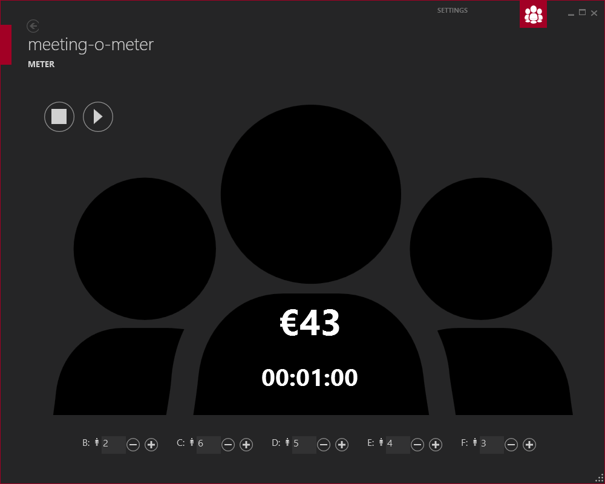

# meeting-o-meter

To measure the costs of a meeting (e.g. a general assembly)

Did you ever attend a meeting that went on and on. And everybody had to say something to make it last even longer. Well if this a recurring event in your life, maybe the meeting-o-meter offers a solution for you. By specifying the number of people, and their hourly rate, you can measure the cost of each second that is (potentially) wasted. At hte least, it gives everyone an insight in the costs of attending such a meeting.

## Using it

- Switch to the settings (top right menu) to change the hourly rates.
- Add the bottom of the screen, specify the number of people
- Press start to start measuring the costs

## Building

Originally developed in Visual Studio 2012, it still works in VS2015. But as it was originally developed in 2013, I have included the libraries that I've used too, as you may not able to find them again.

## About

This is an old project that I developed in 2013, and it recently came up in a conversation. So I looked up the code and am sharing it here. If you want to continue my work, please fork the project, as I am currently using TypeScript for most of my projects, so I can share them on the web. For example, you could:

- Port it to a web environment (I recommend using the [mithril](http://mithril.js.org) framework).
- Add a page to show an agenda
- Add a page to enter the results (so you can do a cost/benefit analysis
- Send/save the results
